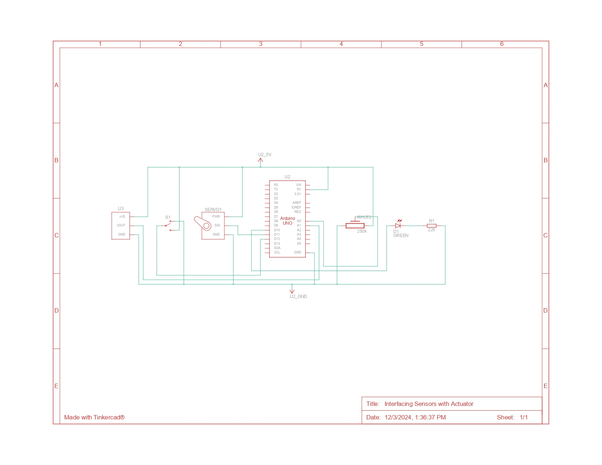

# Interfacing_Sensors_Actuators



This schematic shows the wiring for interfacing sensors (a potentiometer and an LM35 temperature sensor) and an actuator (a servo motor) with an Arduino Uno.

---

### **1. Components**
#### **Microcontroller: Arduino Uno (U2)**
- Acts as the central unit, reading input from sensors and controlling outputs (servo and LED).
- Key Pins:
  - **A0**: Connected to the potentiometer for analog input.
  - **A1**: Connected to the LM35 sensor for temperature reading.
  - **D10**: Outputs a PWM signal to control the LED.
  - **D11**: Controls the servo motor.
  - **D12**: Reads digital input for selecting the control source.

#### **Sensors**
- **Potentiometer (Rpot)**
  - A variable resistor connected to pin A0.  
  - Adjusting the knob changes the voltage level read by A0, which maps to the servo angle and LED brightness in Mode 1.
- **LM35 Temperature Sensor (U3)**
  - An analog temperature sensor connected to pin A1.
  - Outputs a voltage proportional to the temperature (10 mV per °C), used to control the servo and LED in Mode 2.

#### **Actuator: Servo Motor (SERVO1)**
- Controlled via digital pin D11.
- Adjusts its angle based on mapped sensor input.

#### **LED (D1)**
- A green LED connected to pin D10 via a 220-ohm resistor (R1).
- Brightness is adjusted by the PWM signal mapped from sensor input.

#### **Switch (S1)**
- Connected to digital pin D12.
- Used to switch between two control modes:
  - **Mode 1**: Potentiometer input controls the outputs.
  - **Mode 2**: LM35 sensor input controls the outputs.

---

### **2. Circuit Description**
1. **Power Supply:**
   - The circuit operates on a +5V power supply provided by the Arduino Uno's regulated voltage output.

2. **Sensor Connections:**
   - The **potentiometer** (Rpot) is wired as a voltage divider, with its middle pin connected to A0.
   - The **LM35 sensor** outputs an analog signal connected to A1.

3. **Servo Motor:**
   - Powered via the Arduino's 5V and controlled by a PWM signal on D11.

4. **LED and Resistor:**
   - The LED is connected to D10, with R1 limiting current to prevent damage.

5. **Switch:**
   - Used to toggle between the potentiometer and LM35 control modes. Reads `HIGH` or `LOW` on pin D12.

---

### **3. Control Logic**
- When the switch (S1) is in:
  - **LOW position**: The potentiometer (A0) controls the servo angle and LED brightness.
  - **HIGH position**: The LM35 sensor (A1) controls the servo angle and LED brightness.

---

### **4. Key Functionalities**
- **Mode Selection**: Controlled via the switch.
- **Servo Movement**: Angle adjusted based on mapped sensor values.
- **LED Brightness**: Adjusted via PWM duty cycle mapped from sensor values.


### **5. How to COde**

This code interfaces two analog sensors and a servo motor, enabling control based on input readings. Below is a detailed explanation of the code:

---

#### **1. Include the Servo Library**
```cpp
#include <Servo.h>
```
The `Servo.h` library is included to control the servo motor. It simplifies the process of setting angles for the servo.

---

#### **2. Global Variables**
```cpp
int reading = 0;
int duty;
int angle;

Servo servo_11;
```
- `reading`: Stores the analog reading from the sensors.
- `duty`: Represents the duty cycle for PWM output on pin 10, mapped from sensor readings.
- `angle`: The angle value mapped from sensor readings, used to control the servo.
- `servo_11`: Servo object for controlling the servo motor connected to pin 11.

---

#### **3. `setup` Function**
```cpp
void setup()
{
  pinMode(12, INPUT);
  pinMode(A0, INPUT);
  pinMode(10, OUTPUT);
  servo_11.attach(11);
  pinMode(A1, INPUT);
}
```
- **Pin Configurations**:  
  - `12`: Digital input pin for mode selection.  
  - `A0`: Analog input pin for the potentiometer.  
  - `10`: PWM output pin for an LED or other PWM device.  
  - `A1`: Analog input pin for the LM35 temperature sensor.  

- **Servo Initialization**:  
  The servo motor is attached to pin 11 using `servo_11.attach(11)`.

---

#### **4. `loop` Function**
The main logic continuously executes:

##### **Mode Selection**
```cpp
if (digitalRead(12) == 0)
```
- **Mode 1 (Potentiometer Control)**:  
  When pin 12 reads `LOW`, the potentiometer on `A0` controls the servo and the PWM output.

##### **Reading Sensor Input**
```cpp
reading = analogRead(A0);
```
Reads the analog value from the potentiometer or LM35 sensor.  

##### **Mapping Sensor Values**
```cpp
duty = map(reading, 0, 1023, 0, 255);
angle = map(reading, 0, 1023, 0, 180);
```
- `map` function scales the sensor reading:  
  - `duty`: Converts the reading to a range suitable for PWM (0–255).  
  - `angle`: Converts the reading to a range suitable for the servo (0–180 degrees).

##### **Output PWM Signal**
```cpp
analogWrite(10, duty);
```
Generates a PWM signal on pin 10, which could control an LED or other PWM-enabled devices.

##### **Set Servo Angle**
```cpp
servo_11.write(angle);
```
Sets the servo motor to the calculated angle.

---

##### **Mode 2 (Temperature Sensor Control)**
```cpp
else
{
  reading = analogRead(A1);
  duty = map(reading, 20, 359, 0, 255);
  angle = map(reading, 20, 359, 0, 180);
  analogWrite(10, duty);
  servo_11.write(angle); 
}
```
- If pin 12 reads `HIGH`, the LM35 sensor controls the servo and the PWM output.  
- The `reading` from `A1` is mapped to duty cycle and angle ranges based on typical LM35 output (20–359).  

---

##### **Delay**
```cpp
delay(100);
```
Introduces a 100ms delay to stabilize readings.

---

#### **How the Code Works**
- **Input Sources**:  
  - Potentiometer (`A0`) or LM35 sensor (`A1`).  
  - A digital signal on pin 12 selects the control source.  

- **Outputs**:  
  - PWM signal on pin 10 (e.g., to an LED).  
  - Servo motor angle adjustment on pin 11.

- **Mapping and Control**:  
  The input readings are mapped to meaningful ranges for PWM and servo motor control.

---
